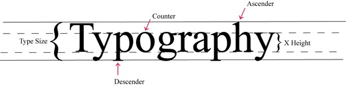

## Typography Essentials

### Basics
Typography is the art and process of arranging type for a variety of media purposes and is made up of several parts

1. Type Size/Cap Height: Overall height of capital letters
2. Ascender: Upward tail on letters like h, l, t, b, d, and k
3. Descender: Downward tail for letters like g, q, and y
4. Counter: White space located inside letters like o and p
5. X Height: Height of the letter without including ascenders or descenders
6. Baselines: Boundary that the lowest part of the letter rests on. The solid line where y, p, g are resting on
7. Kerning: Horizontal space between individual letters of a word
8. Leading: Vertical space between the lines of a text

### Type alignment
- Left Alignment
  - Default writing technique
  - Easy to read
  - Use: Casual letters, unpublished manuscripts
- Center Alignment
  - Draw Attention
  - Use: News Headlines, titles
- Right Alignment
  - Crisp professional look
  - Use: Business cards, return labels
- Justified Alignment
  - Can lead to `tracking` which creates rivers of white space throughout text body
  - Newspaper print, textbooks

### Type category
- Serif
  - Has extensions or strokes on the end of letters
  - Default category for most programs
  - Easy to read for longer pieces
  - Eg: Times New Roman style
  - 
------------
- San-Serif
  - Does not have extensions or strokes on the end of letters
  - Used for labeling, headlines and titles
  - Use: Children books
  - Eg: Helvetica
  - 
------------
- Script, symbols and decorative type
  - Creates a specific image or message
  - Use: Special occasion like wedding, birthdays etc
  - Eg: Hanging Font
  - 
